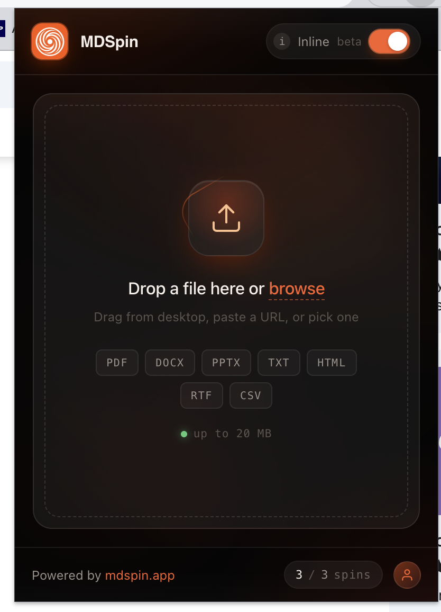
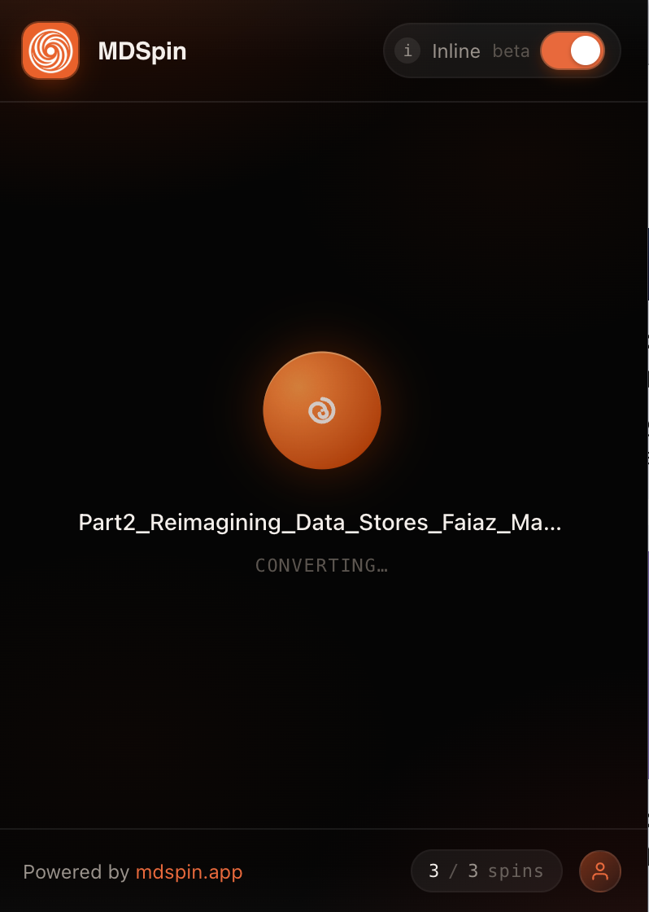
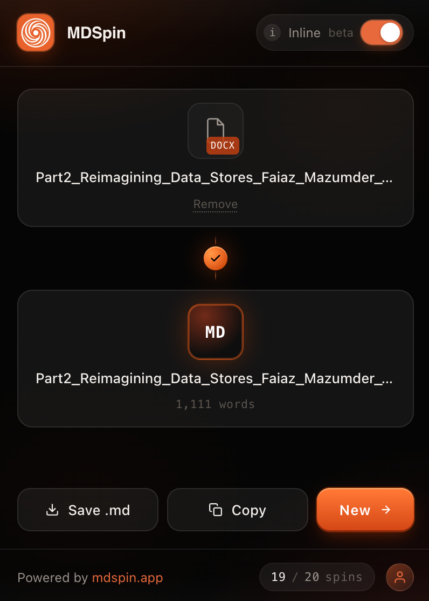

# MDSpin — File to Markdown Converter

A Chrome extension that converts files to Markdown directly inside AI chat interfaces (ChatGPT, Gemini, Claude), so you can drop in a PDF, doc, or image and have clean Markdown ready to paste into the conversation.

Powered by [MDSpin](https://www.mdspin.app).

**[Install from the Chrome Web Store](https://chromewebstore.google.com/detail/mdspin-%E2%80%94-file-to-markdown/jmiinicnfjhndcmmiominecphddngjae)**

## Screenshots

<p>
  
  
  
</p>

## Features

- Converts dropped/selected files to Markdown without leaving the chat page
- Works on `chatgpt.com`, `chat.openai.com`, `gemini.google.com`, and `claude.ai`
- Google sign-in for per-user quota, backed by Supabase auth
- Conversion is proxied through the MDSpin backend — the extension itself ships no API secret, so backend key rotation never breaks already-shipped installs

## Project structure

```
manifest.json           Chrome MV3 manifest
src/
  background/worker.ts   Service worker — OAuth, file conversion requests, cross-context messaging
  content/               Per-site content scripts (chatgpt.ts, gemini.ts, claude.ts, adapter.ts)
  popup/                 Extension popup UI (Preact)
```

## Development

```bash
npm install
npm run dev      # Vite dev build with HMR
npm run build    # Production build into dist/
```

Load the unpacked extension from `dist/` via `chrome://extensions` → **Load unpacked** (enable Developer mode first).

> Note: `npm run build` while the Vite dev server is still running can produce a broken dev-mode loader — stop `npm run dev` before building.

## License

MIT — see [LICENSE](LICENSE).
